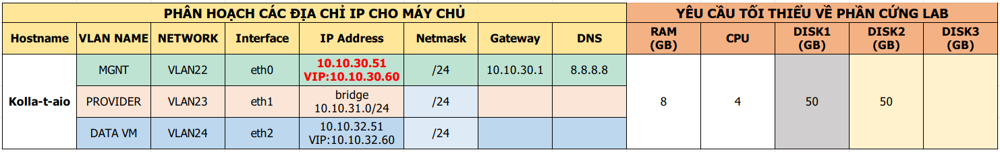

# # Tài liệu triển khai Openstack Train sử dụng Kolla cài theo packages
---
## Mô hình

Cấu hình tối thiểu AIO



Sử dụng 3 Card mạng:
- eth0: Dải Pulic API + SSH
- eth1: Dải Provider VM (Không có IP)
- eth2: Dải Internal, Admin API (Không thể SSH, dùng dải NAT KVM)

Sử dụng 2 Card mạng:
- eth0: Dải Pulic API + SSH
- eth1: Dải Provider VM

- kolla-ansible: phiên bản 9.0.0
- ansible: phiên bản 2.9.x
- pip: phiên bản 19.x

Lưu ý: Có kích hoạt chế độ IPv 6 cho các NIC

## Cài đặt

### Phần 1: Chuẩn bị

Cấu hình hostname
>## Hostname hạn chế đặt ký tự đặc biệt
```
hostnamectl set-hostname kollataio
bash
awk '{print $0, "kollataio"}' /etc/hosts > /tmp/new_file
mv -f /tmp/new_file /etc/hosts
rm -f /tmp/new_file
```

Cấu hình Network
```
echo "Setup IP eth0"
nmcli c modify eth0 ipv4.addresses 10.10.30.51/24
nmcli c modify eth0 ipv4.gateway 10.10.30.1
nmcli c modify eth0 ipv4.dns 8.8.8.8
nmcli c modify eth0 ipv4.method manual
nmcli con mod eth0 connection.autoconnect yes

cat << EOF > /etc/sysconfig/network-scripts/ifcfg-eth1
TYPE=Ethernet
BOOTPROTO=none
NAME=eth1
DEVICE=eth1
ONBOOT=yes
EOF

echo "Setup IP eth2"
nmcli c modify eth2 ipv4.addresses 10.10.32.51/24
nmcli c modify eth2 ipv4.method manual
nmcli con mod eth2 connection.autoconnect yes
```

> ## Lưu ý ko disable IPv6

Tắt Firewall, SELinux
```
sed -i 's/SELINUX=enforcing/SELINUX=disabled/g' /etc/sysconfig/selinux
sed -i 's/SELINUX=enforcing/SELINUX=disabled/g' /etc/selinux/config
systemctl stop firewalld
systemctl disable firewalld
```

Update hệ điều hành
```
yum install -y epel-release
yum update -y
```

Cấu hình đồng bộ thời gian
```
timedatectl set-timezone Asia/Ho_Chi_Minh

yum -y install chrony
sed -i 's/server 0.centos.pool.ntp.org iburst/ \
server 1.vn.pool.ntp.org iburst \
server 0.asia.pool.ntp.org iburst \
server 3.asia.pool.ntp.org iburst/g' /etc/chrony.conf
sed -i 's/server 1.centos.pool.ntp.org iburst/#/g' /etc/chrony.conf
sed -i 's/server 2.centos.pool.ntp.org iburst/#/g' /etc/chrony.conf
sed -i 's/server 3.centos.pool.ntp.org iburst/#/g' /etc/chrony.conf

systemctl enable --now chronyd.service
systemctl restart chronyd.service
chronyc sources -v 

hwclock --systohc 
```

Cài đặt cmdlog
```
curl -Lso- https://raw.githubusercontent.com/nhanhoadocs/ghichep-cmdlog/master/cmdlog.sh | bash
```

Cài đặt môi trường Python

```
yum install -y python-devel libffi-devel gcc openssl-devel \
libselinux-python lvm2 vim git byobu

curl -Lo- https://bootstrap.pypa.io/get-pip.py | python

pip install -U pip
```

Cài đặt môi trường Ansible
```
pip install ansible

mkdir -p /etc/ansible

txt="[defaults]\nhost_key_checking=False\npipelining=True\nforks=100"
echo -e $txt >> /etc/ansible/ansible.cfg
```

Tạo phân vùng Cinder LVM

```
pvcreate /dev/vdb
vgcreate cinder-volumes /dev/vdb
```

> ## Tắt máy và snapshot

### Phần 2: Cài đặt kolla-ansible

Tải kolla-ansible. Tải bản kolla-ansible 9.0.0 (bản dành cho OpenStack Train)
```
pip install "kolla-ansible==9.0.0"

mkdir -p /etc/kolla

cp /usr/share/kolla-ansible/etc_examples/kolla/* /etc/kolla/

cp /usr/share/kolla-ansible/ansible/inventory/* .
```

Thay các dòng bắt đầu là từ localhost bằng hostname của máy cài kolla-ansible
```
sed -i 's/^localhost .*$/kollataio/g' all-in-one
```

Tạo key pair và kiểm tra 
```
ssh-keygen -t rsa -N "" -f ~/.ssh/id_rsa
ssh-copy-id root@kollataio
ssh root@kollataio
```

Kiểm tra lại xem việc khai báo cho ansible đã OK hay chưa
```
ansible -i all-in-one all -m ping
```

Nếu xuất hiện lỗi `[WARNING]: Invalid characters were found in group names but not replaced, use -vvvv to see details` thực hiện xử lý như sau 
```
sed -Ei 's|-|_|g' all-in-one
```
????

Tạo password

```
kolla-genpwd
```

Khai báo cấu hình trước khi triển khai OpenStack bằng kolla. Lưu ý cài đặt OpenStack Train.
```
sed -i "s/#kolla_base_distro: \"centos\"/kolla_base_distro: \"centos\"/" /etc/kolla/globals.yml
sed -i "s/#kolla_install_type: \"binary\"/kolla_install_type: \"source\"/" /etc/kolla/globals.yml
sed -i "s/#openstack_release: \"\"/openstack_release: \"train\"/" /etc/kolla/globals.yml
sed -i "s/#kolla_internal_vip_address: \"10.10.10.254\"/kolla_internal_vip_address: 10.10.11.171/" /etc/kolla/globals.yml
sed -i "s/#network_interface: \"eth0\"/network_interface: eth0/" /etc/kolla/globals.yml
sed -i "s/#neutron_external_interface: \"eth1\"/neutron_external_interface: eth1/" /etc/kolla/globals.yml
sed -i "s/#enable_haproxy: \"yes\"/enable_haproxy: \"no\"/" /etc/kolla/globals.yml
sed -i "s/#enable_cinder: \"no\"/enable_cinder: \"yes\"/" /etc/kolla/globals.yml
sed -i "s/#enable_cinder_backup: \"yes\"/enable_cinder_backup: \"no\"/" /etc/kolla/globals.yml
sed -i "s/#enable_cinder_backend_lvm: \"no\"/enable_cinder_backend_lvm: \"yes\"/" /etc/kolla/globals.yml
```

Kiểm tra lại cấu hình
```
cat /etc/kolla/globals.yml | egrep -v '^#|^$'
```

> ## Sử dụng `byobu` cài đặt nhằm giữ phiên 

Thực hiện các bước cài đặt OpenStack bằng kolla-ansible.
```
byobu
kolla-ansible -i all-in-one bootstrap-servers
kolla-ansible -i all-in-one prechecks
kolla-ansible -i all-in-one pull
kolla-ansible -i all-in-one deploy
kolla-ansible -i all-in-one post-deploy
```

### Phần 3: Cài đặt client openstack

Cài đặt các gói cần thiết để tạo virtualen

```
pip install virtualenv
virtualenv venv
```

Tạo virtualen có tên là venv

`. venv/bin/activate`

Cài đặt các gói openstack client trong virtualenv

```
pip install python-openstackclient python-glanceclient python-neutronclient
source /etc/kolla/admin-openrc.sh
```

Kiểm tra xem OpenStack hoạt động hay chưa

`openstack token issue`

Chạy cấu hình ban đầu

`/usr/share/kolla-ansible/init-runonce`

### Phần 4: Thực hiện sau khi cài đặt xong

- Xóa network sinh mặc định và tạo lại

Sau khi chạy khởi tạo cấu hình ban đầu, kolla sẽ tự động tạo network provider. Network này không dùng được nên ta sẽ xóa đi tạo lại.
Trước tiên cần xóa router -> xóa subnet -> xóa network.

Sau đó tiến hành tạo mới provider network như bình thường.

- Chỉnh config `virt-type` trong nova-compute

Do đặc thù một số trường hợp không hỗ trợ kvm nên ta cần chỉnh config `virt-type` sang `qemu`. Để thực hiện, tiến hành chỉnh ở file `/etc/kolla/globals.yml`

```
nova_compute_virt_type: "qemu"
```

Sau đó reconfigure lại bằng câu lệnh:

`kolla-ansible -i all-in-one reconfigure`
